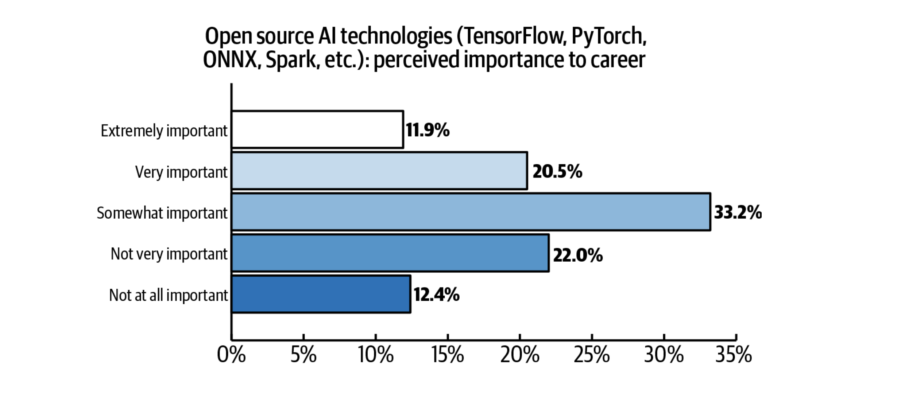

## What is artificial intelligence?

_Give a brief description of what AI is and why developers need to know how to extend their cloud offerings with AI services. In other words, how does AI made cloud offerings better?_

Artificial intelligence leverages computers and machines to mimic the problem-solving and decision-making capabilities of the human mind. AI combines computer science and robust datasets to enable problem-solving.  Integrating AI and machine learning technologies with cloud environments is an increasingly common scenario, driven by use of microservices and the need to scale rapidly. 

AI developers take the models that data scientists create and make them into deployable models that can be used in applications. 

## Problems?

Developers are faced with the challenge to not only build machine learning applications, but to ensure that they run well in production in cloud-native and hybrid cloud environments. 

_EM:::::: This might be too much information but adding it for now:_

Moving an application from a Jupyter notebook<!--EM: is all AI modeling done in Jupyter notebooks?--> to a production environment requires numerous components to work together. These components cover a wide range of tasks that developers and administrators have to manage, including microservices frameworks, code analysis support, monitoring/logging support, continuous integration, secure access to service credentials, UI components, DevOps pipeline, Kubernetes YAML files, manage API access to other business logic components, and so on.

## How is AI related to hybrid cloud in general?

I assume it's b/c teams can choose the cloud that works for their workloads/use cases and then extend their oferings with AI services. So those services need to work well with any cloud. But feel free to expand.

## Solution sketch
Is there a standard architecture for incorporating AI services with a multicloud environment? Are there common tools or concepts inherent to this?

## Key open source projects 
I think these are just filler ones, so feel free to expand. Ones with big, openly governed communities are best.

* PyTorch
* Tensorflow
* ONNX
* Spark
* Keras

### Machine learning model creation

|  | Current release | Release date | Governing body |
| - | - | - | - |
| [Tensoflow](https://podman.io/) | v.3.3.0 | 4 June 2018 | TBD |

### Data exchanges
|  | Current release | Release date | Governing body |
| - | - | - | - |
| [Tensoflow](https://podman.io/) | v.3.3.0 | 4 June 2018 | TBD |

### Deep learning model creation
|  | Current release | Release date | Governing body |
| - | - | - | - |
| [Keras](https://podman.io/) | v.3.3.0 | 4 June 2018 | TBD |
