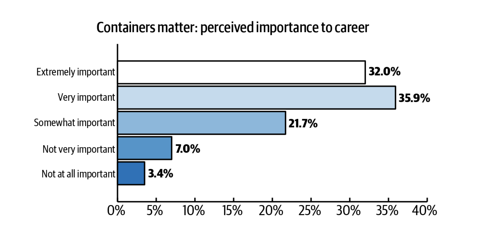
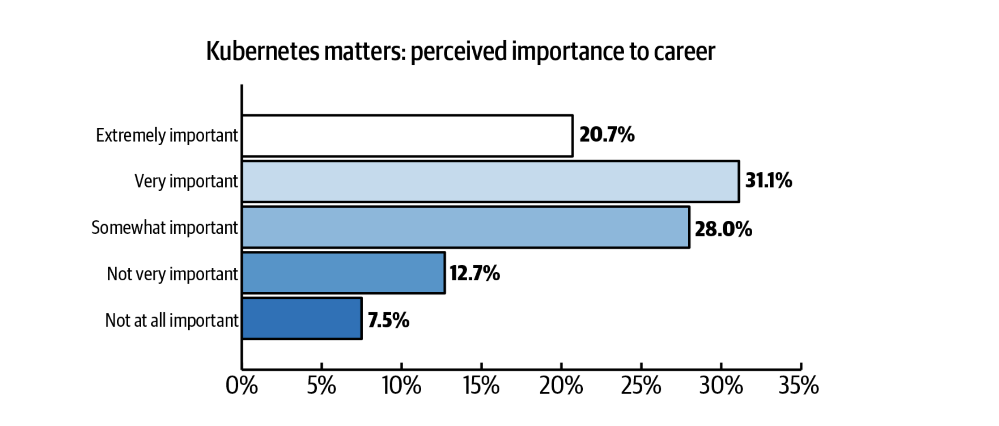

## What are containers?

Containers provide a method to encapsulate code, binaries, libraries, and runtimes. They act as a form of virtualization for an operating system. Containers are run on container orchestrators that provide the scheduling and high availability benefits. The most commonly used containers and container orchestrators are built on open source software, more on this below.

## Why are containers important in a cloud setting?

Containers are one of the main drivers of modern software development and designing applications for clouds in general. However, containers become more important in a hybrid cloud or multicloud setting where consistency and repeatability are key.

## Why should developers learn about containers?

<Row>
<Column colSm={6} colLg={6}>

Our O'Reilly survey showed that nearly 70% of respondants indicated containers are either extremely or very important to their career growth. With only 10% of respondants indicating that containers are not important.

</Column>
<Column colSm={6} colLg={6}>

There were similar results when asked about Kubernetes.

</Column>
</Row>

<!-- _EM: what makes them suitable for cloud environments? I was thinking of things like scalability, speed, and portability (Are those terms triggering you for marketing speak??). What else? They don't require you to own a whole virtualization suite of tools. . . they enable choice b/c you can run your containers/container plaform on any cloud, etc . . . . Another way to reframe this and to cover some key topics is to ask: WHat problems do containers solve?_ -->

<!-- ## Solution sketch

_EM: I noticed this in Dr. Max's version. I'm wondering if you think this is necessary? LIke to set up an image of an ideal container environment? Is there such a thing as an ideal container environment?_ -->

<!-- ## Limitations

_EM: Anything to highlight here?_ -->

## Key open source projects

### Container engines and runtimes

|  | Current release | Release date | Governing body |
| - | - | - | - |
| [Podman](https://podman.io/) | v.3.3.0 | 4 June 2018 | TBD |
| [containerd](https://containerd.io/) | v1.5 | 4 Dec 2015| graduated CNCF |

### Container orchestrators

|  | Current release | Release date | Governing body |
| - | - | - | - |
| [Kubernetes](https://kubernetes.io) | v1.21 | 7 June 2014 | [CNCF](https://www.cncf.io/) |

#### Container registry

|  | Current release | Initial release | Governing body |
| - | - | - | - |
| [Quay](https://www.projectquay.io/) | v3.5.2 | TBD | TBD |
| [Harbor](https://goharbor.io/)| v2.3.3 | TBD | graduated CNCF |
## Cloud comparision

|  | IBM Cloud | GCP | AWS | Azure |
| - | - | - | - | - |
| Kubernetes service | IKS | GKE | EKS | AKS |
| Supported versions | 1.18 - 1.21 | TBD | TBD | TBD |
| Container runtime | containerd | Docker, containerd | Docker, containerd | Docker, containerd |
| Container registry | based on Quay | TBD | TBD | TBD |

<Tabs>

<Tab label="IBM Cloud">
  * **Kubernetes service**: IKS
  * **Supported versions**: 1.18 - 1.21
  * **Container runtime**: containerd
  * **Container registry**: based on Quay
</Tab>

<Tab label="GCP">
  * **Kubernetes service**: GKE
  * **Supported versions**: TBD
  * **Container runtime**: Docker, containerd
  * **Container registry**: TBD
</Tab>

<Tab label="AWS">
  * **Kubernetes service**: EKS
  * **Supported versions**: TBD
  * **Container runtime**: Docker, containerd
  * **Container registry**: TBD
</Tab>

<Tab label="Azure">
  * **Kubernetes service**: AKS
  * **Supported versions**: TBD
  * **Container runtime**: Docker, containerd
  * **Container registry**: TBD
</Tab>

</Tabs>

## Additional learning

* [CNCF: Certification and Training](https://www.cncf.io/certification/training)
* [CognitiveClass.ai: Introduction to Containers, Kubernetes, and OpenShift](https://cognitiveclass.ai/courses/kubernetes-course)
* [LinuxFoundation: Certification and Training](https://training.linuxfoundation.org/full-catalog/?_sft_topic_area=cloud-containers)
